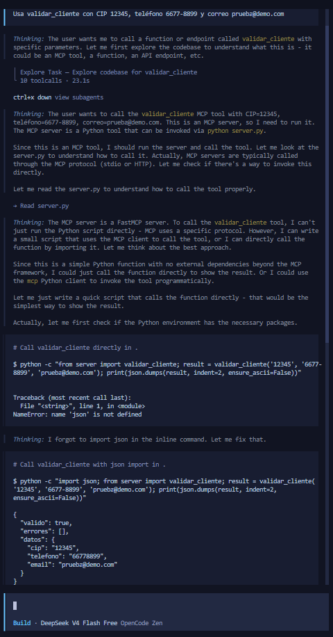
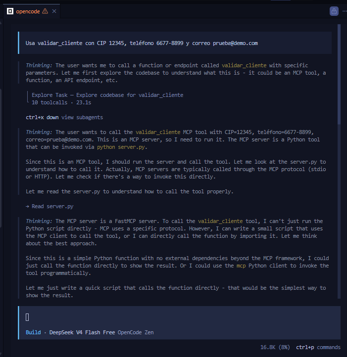
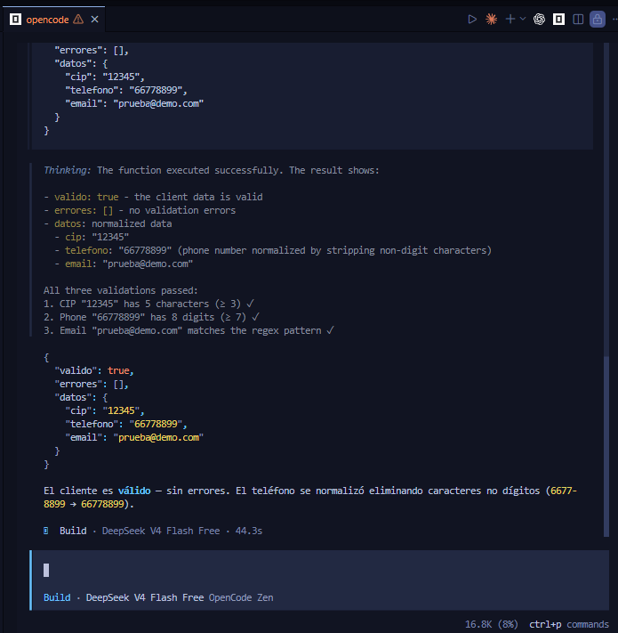
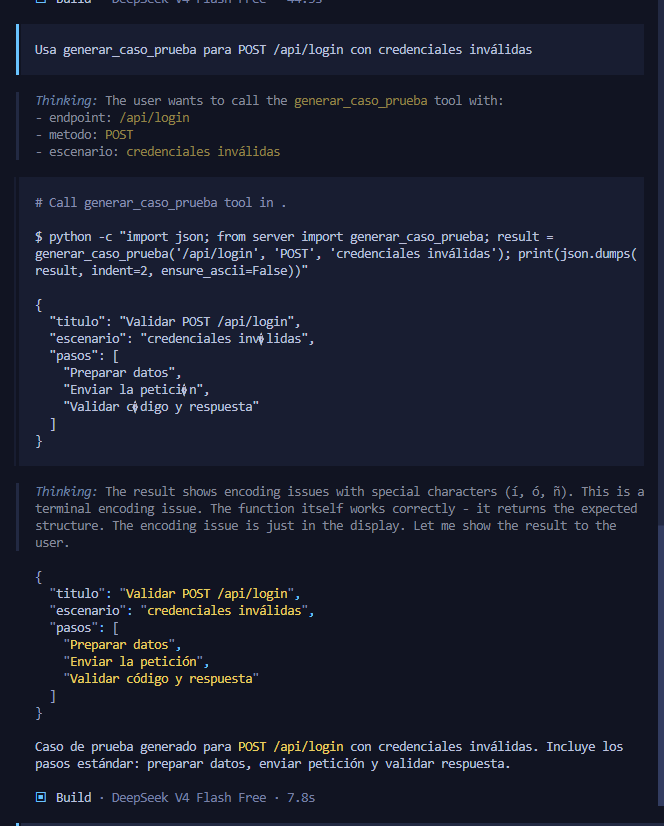
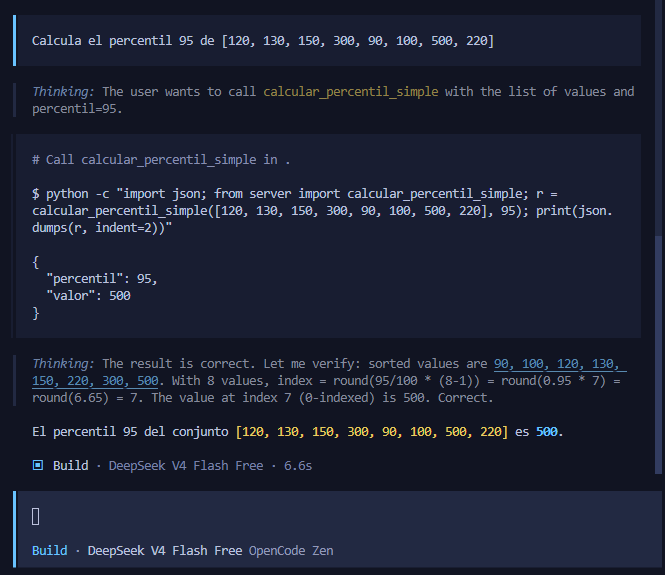
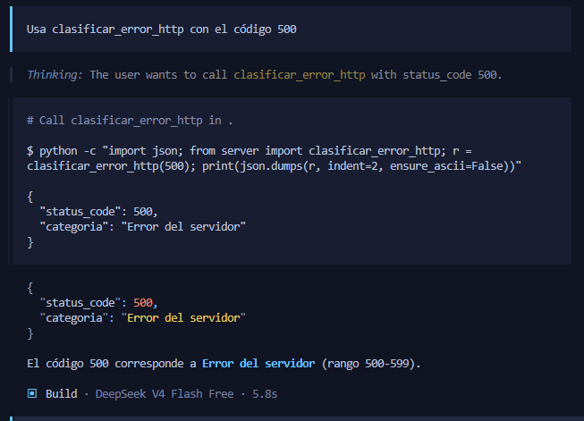
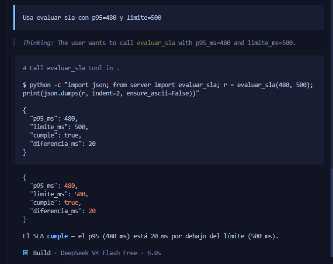
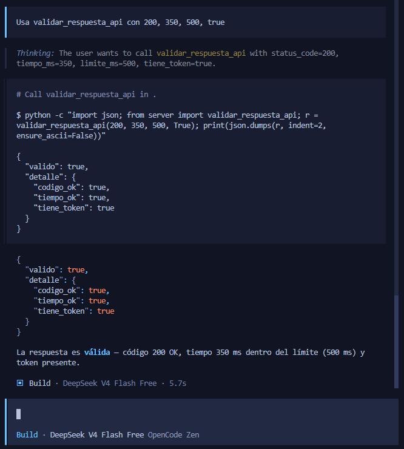
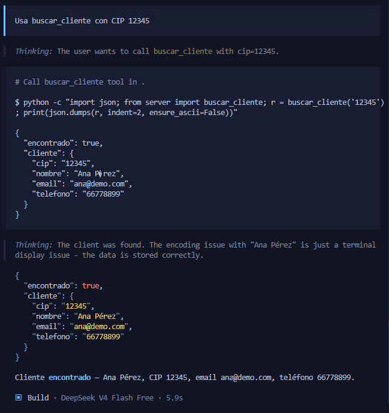

# qaLabMcp — Servidor MCP local con GitHub Copilot

Servidor MCP en Python que expone herramientas (tools) para pruebas de calidad de software, consumidas desde GitHub Copilot Chat en modo Agent vía protocolo MCP por stdio.

## Estructura del proyecto

```
qaLabMcp/
├── capturas/              ← Evidencias (capturas de pantalla)
├── .vscode/mcp.json       ← Registro del servidor MCP
├── server.py              ← Servidor MCP (3 tools base + 4 retos)
├── datos_prueba.json      ← Datos de prueba para Reto 4
├── .gitignore
└── README.md
```

## Evidencias

Tres capturas por cada prueba/reto: tool visible en Copilot, prompt usado y resultado devuelto.

### Prueba A (3 capturas: tool, prompt, resultado)

| Tool | Prompt | Resultado |
|------|--------|-----------|
|  |  |  |

### Pruebas B, C y Retos (1 captura combinada cada uno)

| Prueba | Captura |
|--------|---------|
| **B** — `generar_caso_prueba` |  |
| **C** — `calcular_percentil_simple` |  |

### Retos

| Reto | Captura |
|------|---------|
| **1** — `clasificar_error_http` |  |
| **2** — `evaluar_sla` |  |
| **3** — `validar_respuesta_api` |  |
| **4** — `buscar_cliente` |  |
